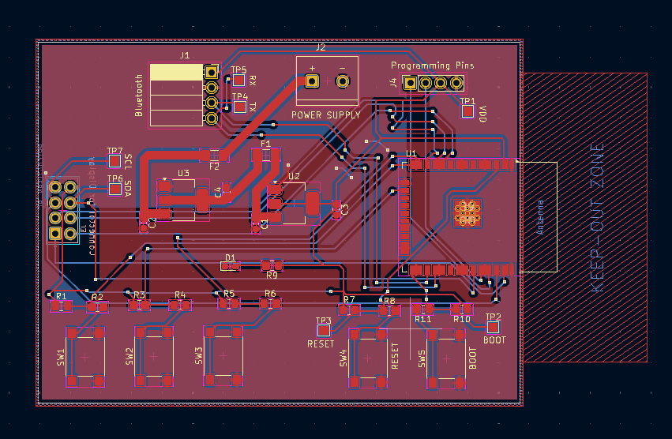

# Modular Remote Control System for Motorcycle

## Overview

This project is a modular remote control system designed to interface with a motorcycle's main MCU board. The remote module is built using an ESP32 microcontroller and communicates with the main board via Bluetooth. An e-paper display is integrated to provide real-time status updates and control feedback, making it a user-friendly and efficient control interface for two-wheeler embedded systems.

## Features

- ESP32-based microcontroller
- Bluetooth communication with the main MCU board
- E-paper display for control status and feedback
- Powered by 12V, compatible with standard motorcycle electrical systems

## Software Tools

- **KiCAD Version:** 8.0
- **External Libraries:** Most of the component libraries used in this project are sourced from Ultra Librarian. Refer to the `libraries/` section for more details.

## Fabrication

**Note:** This design has not been fabricated yet. If you plan to fabricate the PCB, make sure to thoroughly check the schematic and PCB layout before proceeding to production.

## Contact

**Name:** Gokul Rajaram  
**Email:** gokulrajarama@gmail.com  
**Phone:** +91 9025938754

